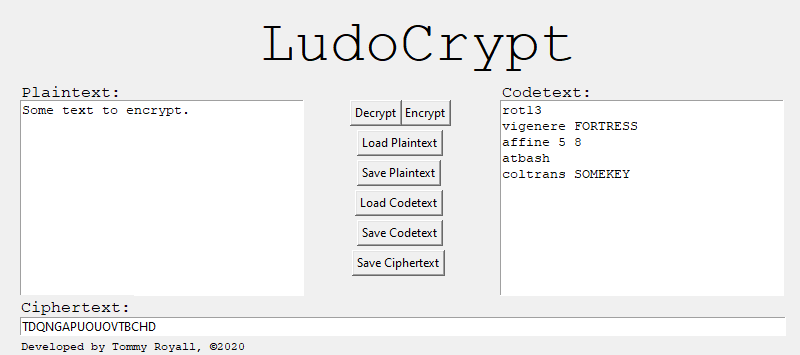

# LudoCrypt
LudoCrypt is a user-scripted cryptography program. It is not intended for serious cryptographic implementations, and as the etymology of the name suggests, is intended to be more of a fun learning experience than anything else. It is aimed at people who want to learn about cryptography and who use cryptography for non-serious tasks, as well as for people who may be interested in expanding the user-scriptability in other directions. It is entirely open source, and always will remain free, and any user is free to branch and alter it as they please. 

LudoCrypt relies on the concept of stacking encryption algorithms for security, whereas a single caesar cipher is child's play to solve, a series of ciphers all stacked upon one another is slightly more fortified. 

LudoCrypt's name comes from the Latin (as well as Esperanto) word for play, *Ludo*, and from the greek word *Kruptos*, but loaned through English from the word *Encrypt*. 

# Dependencies
Ludocrypt is written in **Python *(3.7.6)***, and utilizes stock libraries (including **Tkinter *(8.6)***), as well as [**PyCipher *(0.5.2)***](https://github.com/jameslyons/pycipher).

# How To Use
Ludocrypt can be run as simply as `python ludocrypt.py`. Once the program is open, you will be presented with two text boxes, one for plaintext and one for codetext. The plaintext is the text that you will be encrypting/decrypting, and the codetext is the series of ciphers through which the plaintext will be encrypted/decrypted. Using the **Encrypt** and **Decrypt** buttons will encrypt or decrypt the plaintext according to the codetext's instructions. The encrypted or decrypted output will be placed in the bottom textbox, labeled **Ciphertext**. There are also six buttons for saving and loading to any of the aforementioned text boxes.

# Documentation
Ludocrypt currently has 14 ciphers implemented, and they are:
 * **ADFGX**: A 25 character, alphabetical string (which works internally as a keysquare) as the first argument, as well as a keyword of any given size (alphabetical only) for the second argument.
 * **ADFGVX**: A 36 character, alphabetical string (which works internally as a keysquare) as the first argument, as well as a keyword composed of alphabetical characters of any size for the second argument.
 * **Affine**: This cipher takes 2 numerical arguments. The first of which is limited to: 1, 3, 5, 7, 9, 11, 15, 17, 19, 21, 23 or 25. The second argument can be any value between 0 and 25.
 * **Autokey**: Autokey takes a string argument of any given length, as long as it is composed of nothing but alphabetical characters.
 * **Atbash**: Atbash takes no keys, it functions without arguments.
 * **Beaufort**: Takes a string argument of any given length, as long as it is composed of strictly alphabetical characters.
 * **Bifid**: Takes a 25 character, alphabetical string (which is functioning internally as a keysquare), with a second argument that is any given integer (functioning internally as the algorithm's "period").
 * **Caesar**: Takes an integer argument between 1 and 25.
 * **Coltrans (Columnar Transposition)**: Takes a string as the keyword, of any given length as long as it is composed strictly of alphabetical characters.
 * **Playfair**: A 25 character, alphabetical string of text (functioning internally as a keysquare).
 * **Railfence**: Any integer greater than 0 can be used as an argument.
 * **Rot13**: Rot13 takes no keys, it functions without arguments.
 * **Simplesub**: A 26 character representation of the alphabet, but with letters in varying positions. An example argument could be "AWCQEJGHIFKZMNOPDRSTUVBXYL".
 * **Vigenere**: A string is taken as the keyword, with no punctuation or numbers.
Further information on these ciphers can be found [here](http://www.practicalcryptography.com/ciphers/).

# Example

# Future Sights
LudoCrypt is a project that has the potential to keep growing and expanding with time. Some of what it may find in the future:
 * Loading plaintext files and processing them in batch.
 * Integrate a warning system when using destructive ciphers (such as Autokey).
  * Having a no-warning flag that defaults to false would be nice, if a .cfg system was to be implemented.
 * Implementing some more ciphers from PyCipher:
  * Polybius Square.
  * Porta.
  * M-209.
  * Enigma.
  * Modifying the Caesar cipher to be able ot move negatively as well as positively, for example rot-3 turning "def" into "abc".
 * Warnings & errors system, that details issues in codetext (syntax errors for example).

If you find yourself contributing to LudoCrypt or developing on a branch of it, these are the resources that helped me:
 * https://pycipher.readthedocs.io/en/master/
 * http://www.practicalcryptography.com/ciphers/
